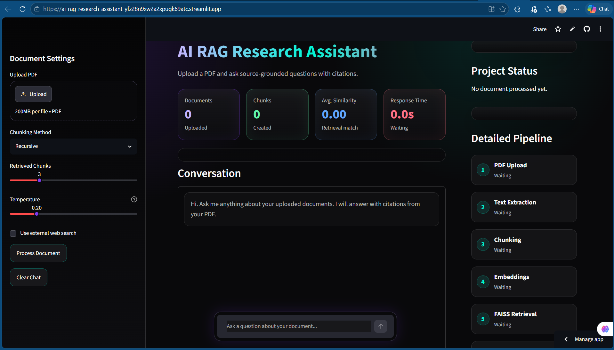
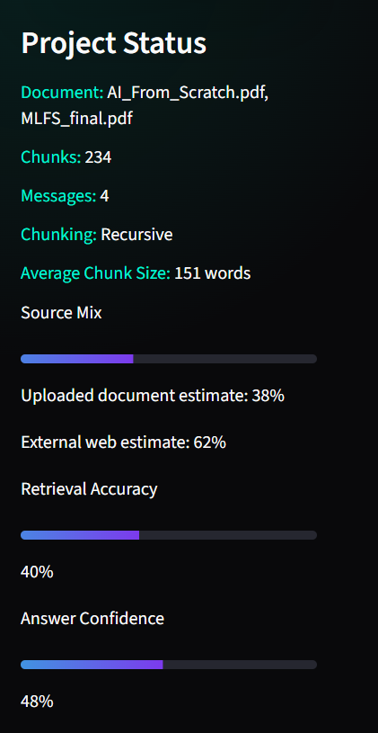
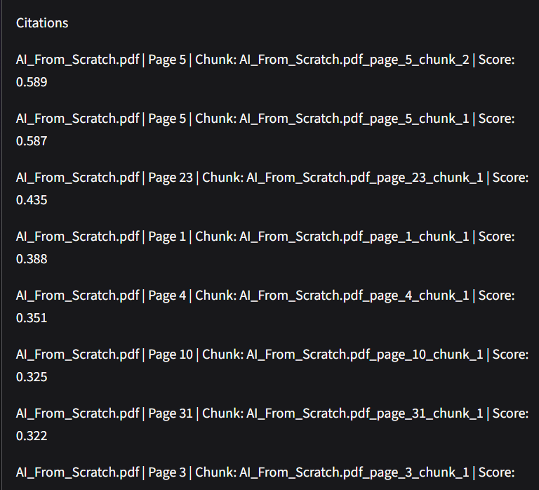

# AI RAG Research Assistant

A source-grounded AI research assistant that lets users upload PDFs and ask questions with citations.

## Live Demo

[Try the app here](YOUR_STREAMLIT_APP_LINK)

## Project Overview

This project demonstrates a complete Retrieval Augmented Generation pipeline. Users upload PDF documents, the system extracts text, chunks the content, creates embeddings, stores vectors in FAISS, retrieves relevant chunks, and generates grounded answers using Gemini.

Unlike a generic chatbot, this assistant answers from uploaded documents and shows citations, confidence signals, retrieval scores, and source references.

## Key Features

- PDF upload and page-wise text extraction
- Fixed, recursive, semantic, and document-aware chunking
- Embeddings using `all-MiniLM-L6-v2`
- FAISS vector search
- Gemini-powered answer generation
- Source-grounded citations with file name, page number, and chunk ID
- Continuous chat memory for follow-up questions
- Question rewriting for references like "it", "this", and "that"
- Temperature control for predictable vs creative answers
- Optional external web search
- Source mix estimate: uploaded document vs web context
- Retrieval accuracy and answer confidence score
- Warning when an answer may not exist in uploaded documents
- Streamlit frontend with recruiter-friendly dashboard

## Screenshots

### Home Page


### Answer Generated


### Pipeline


### Answer Details


### Project Status


### Citations


## RAG Pipeline

```text
PDF Upload
  -> Text Extraction
  -> Chunking
  -> Embedding Generation
  -> FAISS Vector Store
  -> Similarity Search
  -> Gemini LLM
  -> Answer + Citations
  