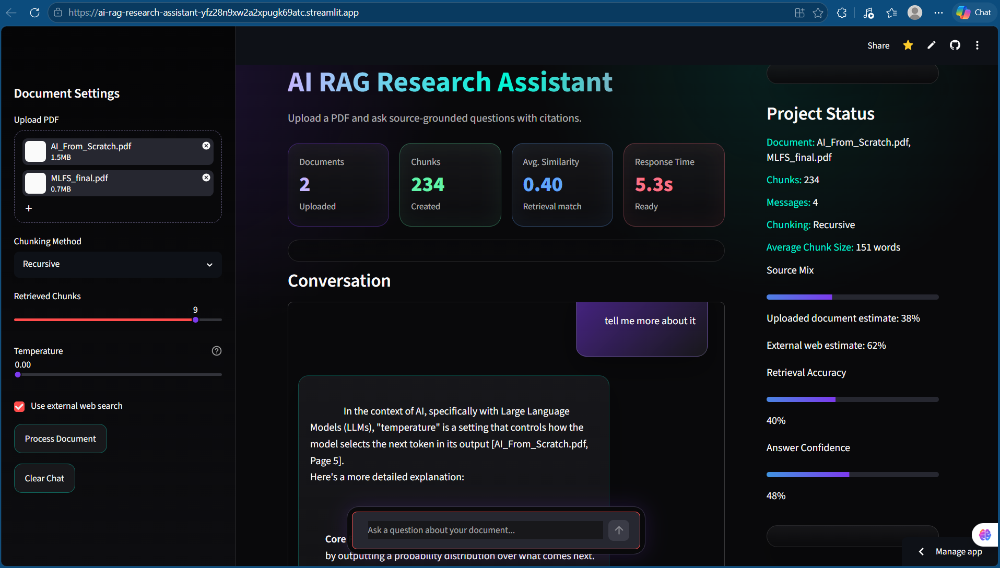
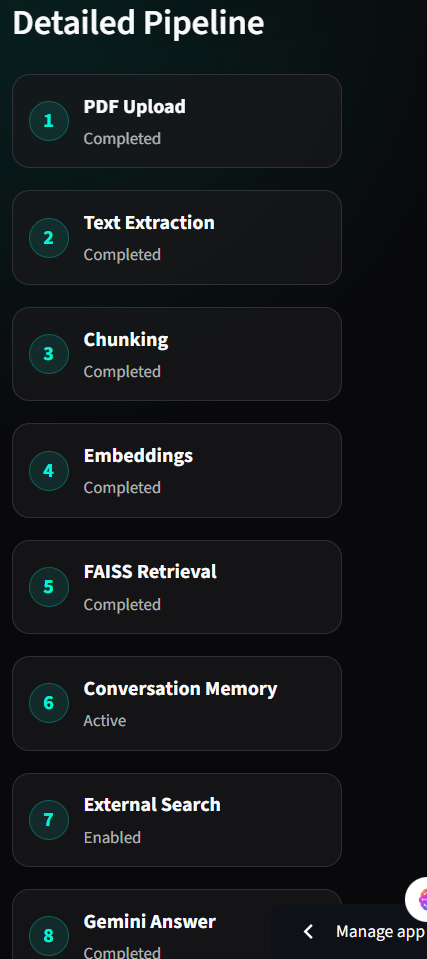
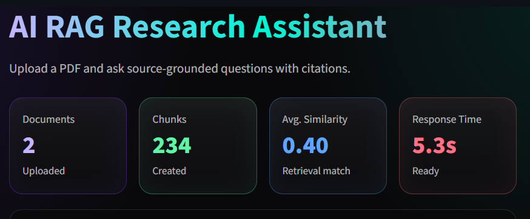

# AI RAG Research Assistant

A source-grounded AI research assistant. Upload PDFs, ask questions, and get answers with citations, retrieval scores, and a live "RAG Inspector" that shows exactly how each answer was produced.

## Live Demo

_Add your deployment URL here (e.g. your Vercel app link)._

## Project Overview

This project implements a complete Retrieval Augmented Generation (RAG) pipeline as a single self-contained [FastAPI](https://fastapi.tiangolo.com/) service that is safe to deploy on serverless platforms like Vercel.

Users upload PDF documents. The system extracts text, chunks it, retrieves the most relevant chunks for a question using **hybrid retrieval** (semantic embeddings + BM25 lexical scoring), injects them into a grounded prompt, and streams an answer from Google Gemini — with citations back to the source file, page, and chunk.

Unlike a generic chatbot, this assistant answers from your uploaded documents and is transparent about how: it shows retrieval scores, matched terms, the exact prompt sent to the model, and a warning when an answer may not be supported by the documents.

## Key Features

- PDF upload and page-wise text extraction (`pypdf`)
- Word-window chunking with overlap
- **Hybrid retrieval**: Gemini embeddings (`text-embedding-004`) for semantic similarity, combined with BM25 lexical scoring, with automatic fallback to BM25-only when embeddings are unavailable
- Per-document caching keyed by file content hash, so a PDF is parsed and embedded once per session instead of on every question
- Gemini-powered, **streamed** answer generation (Server-Sent Events)
- Source-grounded citations with file name, page number, and chunk ID
- Two answer modes: **Research Mode** (professional, factual) and **Bestie Mode** (casual, fun)
- Temperature tuned per mode for predictable vs. creative answers
- **RAG Inspector** UI: query terms, retrieved chunks with similarity scores, matched terms, and the full prompt sent to Gemini
- Single-page UI served directly by the backend — no separate frontend build

## Architecture

```text
PDF Upload (multipart)
  -> Text Extraction (pypdf)
  -> Chunking (word windows + overlap)
  -> Hybrid Retrieval
       - Semantic: Gemini text-embedding-004 + cosine similarity
       - Lexical:  BM25 over tokenized chunks
       - Combined + ranked, with BM25-only fallback
  -> Grounded Prompt Construction
  -> Gemini (streamed) -> Answer + Citations
```

Retrieval and ranking logic lives in [`src/retrieval.py`](src/retrieval.py) (pure, dependency-light, unit-tested). The FastAPI app, embedding integration, caching, and UI live in [`src/app.py`](src/app.py).

## Running Locally

```bash
python -m venv venv
venv/Scripts/activate        # Windows
# source venv/bin/activate   # macOS / Linux

pip install -r requirements.txt

# set your Gemini key (or put it in a .env file as GEMINI_API_KEY=...)
export GEMINI_API_KEY=your_key_here

uvicorn src.app:app --reload
```

Then open http://127.0.0.1:8000.

### Configuration

| Variable | Required | Description |
| --- | --- | --- |
| `GEMINI_API_KEY` | yes | Google Gemini API key used for embeddings and answer generation |
| `ALLOWED_ORIGINS` | no | Comma-separated list of allowed CORS origins (defaults to `*`) |
| `MAX_UPLOAD_MB` | no | Per-file upload size limit in MB (default `15`) |

## Testing

```bash
pip install -r requirements.txt
pytest
```

The retrieval logic is covered by deterministic unit tests in [`tests/`](tests/) that run fully offline (no API key required). CI runs them on every push via GitHub Actions.

## Screenshots

### Home Page


### Answer Generated


### RAG Inspector


### Answer Details


### Project Status


### Citations

